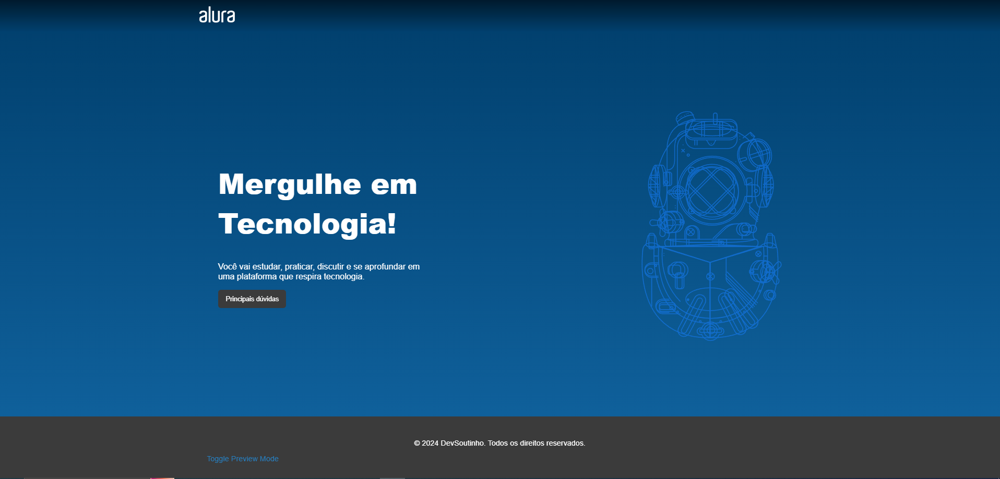
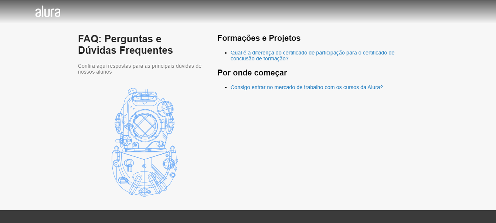

# Projeto NextJs-CMS

Projeto desenvolvido durante o curso de NextJs: trabalhando com um CMS

# Principais tecnologias utilizadas no projeto
* NextJs
* NodeJS
* CMS - DATOCMS
* Styled-Components
* Lodash
* React-datocms

# Imagens do projeto

Pagina inicial do projeto

Pagina de FAQ
